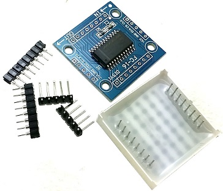

# ArduinoNano-Matrix-LED

Software for Arduino Nano to control 8x8 Dot Matrix LED based on MAX7219 ICs in FC-16 boards with led matrix model 1088AS

## Features
- Configurable matrix size by attaching multiple Dot Matrixes
- Configurable marquees and animations to display
- Interactive games through joystick
